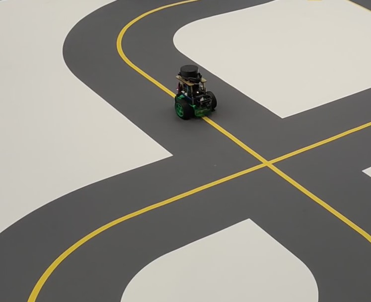
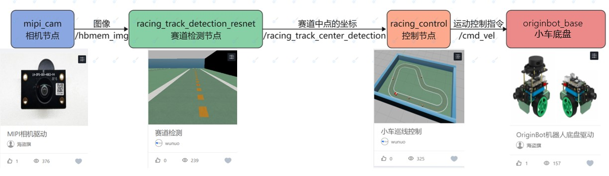

# racing_line_follower


视觉巡线Demo基于纯视觉的方法实现赛车在赛道内运动，其中赛道中间有引导线辅助赛车保持在赛道内。



为实现上述功能，需要视觉输入、环境感知、运动控制三大模块，其中：

视觉输入模块负责获取真实世界(或仿真世界)的图像并传递给下一级环境感知模块；

环境感知模块负责感知赛车在赛道中的位置，并将相关信息传递给运动控制模块；

运动控制模块根据环境感知模块输出的赛车位置信息计算得出合理的运动控制指令并下发给赛车进行对应运动。


接下来需要对上述三个大的模块进行细化和实现以完成视觉巡线Demo。[NodeHub](https://developer.horizon.cc/nodehub)是地平线为广大机器人开发者提供的“智能机器人应用中心”，该应用中心包含多个类别不同功能的开源Node，能够快速安装和使用，通过串联不同的Node可以完成对上述三大模块的实现。

# 实现细节

## 视觉输入

[NodeHub](https://developer.horizon.cc/nodehub)中“外设适配”栏目包含多种传感器和机器人底盘的适配，可以轻松获取图像、点云数据。这里选择[《MIPI相机驱动》](https://developer.horizon.cc/nodehubdetail/168958376283445781)来获取实现视觉输入模块。选择该模块的主要原因是该模块支持GC4663大FOV相机，视角更大，有利于赛车完成巡线。

查看《MIPI相机驱动》Node可知：

该Node支持1920x1080、640x480等多种常见分辨率；

发布话题为/hbmem_image、/image_raw、/camera_info；

可以通过ros2 launch加载不同launch文件的方式选择分辨率。

综合考虑下一级感知模块的精度和系统负载，这里选择mipi_cam_640x480_nv12_hbmem.launch.py配置文件，即以共享内存的方式发布640x480分辨率的NV12格式图像。

点击Node页面“一键部署”按钮，将生成的如下命令拷贝至RDK X3终端运行

```shell
sudo apt update
sudo apt install -y tros-mipi-cam
```
在完成“一键部署”后，启动该Node的命令为
```shell
source /opt/tros/setup.bash
ros2 launch mipi_cam mipi_cam_640x480_nv12_hbmem.launch.py
```

## 环境感知

赛道检测，检测赛道中引导线相对赛车本体的位置关系

[NodeHub](https://developer.horizon.cc/nodehub)中“比赛专区”栏目中[《赛道检测》](https://developer.horizon.cc/nodehubdetail/184587678518566919)基于深度学习的方法识别图像中赛道的中点并以话题的形式发布。

查看《赛道检测》Node可知：

该Node订阅/hbmem_image话题，类型为hbm_img_msgs/msg/HbmMsg1080P，此话题与视觉输入模块发布的话题一致，可以获取视觉输入模块的图像数据；

该Node将计算处理后的赛道中点值以/racing_track_center_detection话题发布，类型为geometry_msgs/msg/PointStamped；

模型文件默认路径/opt/nodehub_model/race_detection/race_track_detection.bin，更新模块可以替换该文件；

点击Node页面“一键部署”按钮，将生成的如下命令拷贝至RDK X3终端运行

```shell
sudo apt update
sudo apt install -y tros-racing-track-detection-resnet
```

在完成“一键部署”后，启动该Node的命令为

```shell
source /opt/tros/setup.bash
ros2 launch racing_track_detection_resnet racing_track_detection_resnet.launch.py
```
模型训练方式可参考[《赛道检测模型训练部署全过程讲解》](https://developer.horizon.cc/forumDetail/185446272545810434)

## 运动控制

[NodeHub](https://developer.horizon.cc/nodehub)中“比赛专区”栏目中[《小车巡线控制》](https://developer.horizon.cc/nodehubdetail/184587678518566923)接收赛道识别节点的消息，控制小车巡线。

查看《小车巡线控制》Node可知：

该Node订阅/racing_track_center_detection话题，类型为geometry_msgs/msg/PointStamped，此话题与《赛道检测》Node发布的话题一致，用于获取赛道信息进行巡线控制；

该Node综合感知信息将计算处理后将控制信息以/cmd_vel话题发布，类型为geometry_msgs/msg/Twist；

点击Node页面“一键部署”按钮，将生成的如下命令拷贝至RDK X3终端运行
```shell
sudo apt update
sudo apt install -y tros-racing-control
```
在完成“一键部署”后，启动该Node的命令为
```shell
source /opt/tros/local_setup.bash
ros2 launch racing_control racing_control.launch.py
```

## 启动底盘
[NodeHub](https://developer.horizon.cc/nodehub)中“外设适配”栏目包含多种机器人底盘，需要按照机器人型号选择，此处以[《Originbot底盘驱动》](https://developer.horizon.cc/nodehubdetail/170117036053371431)为例，该节点接收控制节点的消息，分解为对各个电机的控制，实现小车运动

查看《Originbot底盘驱动》Node可知：

该Node订阅/cmd_vdel话题，类型为geometry_msgs/msg/Twist，此话题与《小车巡线控制》Node发布的话题一致，用于获取控制信息进行电机控制；

点击Node页面“一键部署”按钮，将生成的如下命令拷贝至RDK X3终端运行
```shell
sudo apt update
sudo apt install -y tros-originbot-base tros-serial tros-originbot-msgs
```
在完成“一键部署”后，启动该Node的命令为
```shell
source /opt/tros/setup.bash
ros2 launch originbot_base robot.launch.py 
```

至此，视觉循线Demo已经搭建完成整体详细框图如下图所示。
